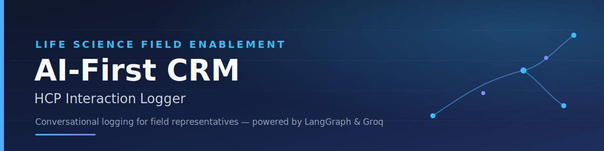

<div align="center">



<br/>


</div>

<br/>

## Overview

**AI-First CRM: HCP Interaction Logger** is a Customer Relationship Management module purpose-built for Life Science field representatives to record interactions with Healthcare Professionals (HCPs). The application offers a **dual-interface experience**, allowing users to log data through either:

- A traditional, structured form, or
- A conversational AI chat interface

---

## Table of Contents

- [Tech Stack](#tech-stack)
- [LangGraph AI Agent & Tools](#langgraph-ai-agent--tools)
- [Getting Started](#getting-started)
  - [1. Database Setup](#1-database-setup)
  - [2. Backend Setup](#2-backend-setup)
  - [3. Frontend Setup](#3-frontend-setup)

---

## Tech Stack

| Layer | Technology |
|---|---|
| **Frontend** | React (Vite), Redux Toolkit, Tailwind CSS, Google Inter Font |
| **Backend** | Python, FastAPI, SQLAlchemy |
| **Database** | MySQL |
| **AI Agent Framework** | LangGraph |
| **LLM** | Groq (`gemma2-9b-it` / `llama-3.3-70b-versatile`) |

---

## LangGraph AI Agent & Tools

The core of this application is powered by a **LangGraph agent**. When a user types a message in the chat, the agent interprets the natural language input and intelligently invokes specific tools to extract and process the data — instantly auto-filling the frontend form.

### The 5 Sales-Related Tools Utilized by the Agent

| # | Tool | Description |
|---|---|---|
| 1 | **`log_interaction`** | Captures raw interaction data (HCP name, topics, outcomes) from natural language and prepares it for database insertion. |
| 2 | **`edit_interaction`** | Allows the user to modify or append data to an already logged interaction via chat. |
| 3 | **`search_hcp_history`** | Retrieves past interaction contexts to help the rep prepare for a meeting. |
| 4 | **`schedule_follow_up`** | Extracts dates and tasks to schedule follow-up actions (e.g., *"Remind me to send brochures next week"*). |
| 5 | **`analyze_sentiment`** | Analyzes conversational notes to infer the HCP's sentiment (Positive, Negative, Neutral) and auto-selects the corresponding radio button in the UI. |

---

## Getting Started

Follow the steps below to run the project locally.

### 1. Database Setup

Ensure MySQL is running (e.g., via XAMPP) on port `3306`, then create a database named `crm_db`.

### 2. Backend Setup

```bash
# Navigate to the backend directory
cd backend

# Create a virtual environment
python -m venv venv

# Activate the environment
# Windows
venv\Scripts\activate
# Mac/Linux
source venv/bin/activate

# Install dependencies
pip install fastapi uvicorn sqlalchemy pymysql langgraph langchain-groq pydantic python-dotenv
```

Create a `.env` file in the backend folder (see `.env.example`) and add your Groq API key.

```bash
# Start the server
uvicorn main:app --reload
```

### 3. Frontend Setup

```bash
# Navigate to the frontend directory
cd frontend

# Install dependencies
npm install

# Start the Vite development server
npm run dev
```

---

<div align="center">

Built for Life Science field teams — logging HCP interactions, the conversational way.

</div>
